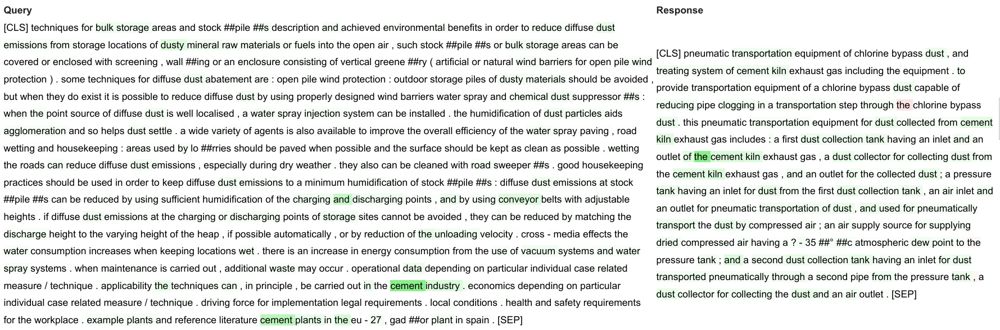

# patents4IPPC: Patents for industrial pollution prevention and control

## Context

The European Green Deal aims to achieve a circular economy with zero pollution. Due to their considerable environmental impact, large industrial installations naturally constitute one of the main areas of focus. The present project is done in collaboration with the Directorate Growth and Innovation of the Joint Research Centre (JRC) of the European Commission. JRC regularly compiles reference documents on Best Available Techniques (BAT), called BREFs, giving a clear picture of the state-of-the-art in the field of industrial pollution prevention and control in all Member states. The ultimate objective behind this effort is to map environmental capabilities across the EU and the world, analyze them with the tools of Economic Complexity, and check if they match the need for clean technology. One way to achieve this is to retrieve geo-localized documents describing R&D activities, in particular patents, across the EU and the world.

**In this project/repository**, we set out to build an Information Retrieval (IR) system that is able to retrieve relevant patents from queries based on specific subsections of BREF documents. Following recent advances in the field of Natural Language Processing, we build an IR engine based on the Transformer architecture supported by [FAISS](https://github.com/facebookresearch/faiss) indexing and demonstrate its superiority compared to legacy approaches. We train and fine-tune our model using several open source datasets and assess its effectiveness by comparing its performance with that of baseline approaches on a brand new dataset provided by JRC.

In particular, the models developed so far were fine-tuned on Industrial Pollution Prevention and Control (IPPC) documents. The engine is fed passages taken from documents called BREFs, which provide technical descriptions of the Best Available Techniques (BAT) in the field of IPPC, and retrieves relevant abstracts from a patent corpus. The former consists of possibly long text fragments concerning the topic considered, while the latter are shorter and exhibit a more technical language.

🇪🇺 A complete description of the project can be found on EU Pubblication: [Patents for industrial pollution prevention and control, Bratières, Sébastien et al., doi:10.2760/056875](https://op.europa.eu/en/publication-detail/-/publication/62438d8a-410c-11ec-89db-01aa75ed71a1/language-en).

## Authors

This project was realized by [Pi School](https://twitter.com/picampusschool)

[Francesco Cariaggi](https://twitter.com/FCariaggi) (Deep Learning Engineer) <br/>
[Cristiano De Nobili, PhD](https://twitter.com/denocris) (Deep Learning Research Scientist) <br/>
[Sébastien Bratières](https://twitter.com/Seb_Bratieres) (Director of AI @ Pi School)

This project was conceptualized and commissioned by the [Joint Research Centre](https://ec.europa.eu/info/departments/joint-research-centre_en)

Robert Marschinski (JRC - Seville) <br/>
Andrea Tacchella (JRC - Seville)

## Engine Description

Two main components take part of our engine:

* A meaningful text embedder

  Our models are based on pre-trained Transformers which are compatible with HuggingFace's [transformers](https://huggingface.co/transformers/) library. Most of them were first adaptive-tuned on the specific domain language and then fine-tuned on semantic similarity in a siamese-networks setup taking advantage of the [sentence-transformers](https://sbert.net/) library (SBERT).

  We then extended the siamese-networks approach to the case of different models for query and response sides. With this purpose we built the DualTransformer, a 2-in-1 model that uses different architectures for embedding queries and responses.

  Note that the models mentioned above are "regular" Transformers, therefore they come with all the known limitations in terms of maximum sequence length and memory requirements. To partly overcome these limitations, we introduce two additional classes of models that can deal with text sequences exceeding 512 tokens (maximum length for BERT-like models):

   1. [Longformer](https://arxiv.org/abs/2004.05150)
   2. [Hierarchical Transformer](https://ieeexplore.ieee.org/document/9003958)

  While several other variants of the original Transformer architecture have been proposed in the literature to deal with long texts, the two mentioned above have a fundamental feature: they can build on pre-trained regular Transformers.

  Finally, we also provide simple baseline models, such as TF-IDF, Glove Embeddings and Universal Sentence Encoder (USE).

* A retrieval pipeline

  Once all response embeddings present in a database are computed, a fast retrieval pipeline based on [FAISS](https://github.com/facebookresearch/faiss) indexing can be used to match the most relevant abstracts (according to cosine similarity) to a given query as fast as possible.

## How to install

To run the code, you need to install Anaconda first. See the instructions on [how to install Anaconda](https://docs.anaconda.com/anaconda/install/) for your system. Once Anaconda is installed, create a new virtual environment from the [environment_linux.yml](environment_linux.yml) or [environment_macos.yml](environment_macos.yml) file by running:

```sh
conda env create -f environment_your_os.yml
```

**Note**: you cannot take advantage of GPU-accelerated libraries (namely FAISS, PyTorch and transformers) if you are using MacOS.

<!---
```
We also need to clone a GitHub repository that will allow us to download useful files from Google Drive with ease:

```sh
git clone --depth=1 https://github.com/matthuisman/gdrivedl.git
```
```
-->

## Datasets

The datasets we have experimented with are:

- AllNLI (combination of [SNLI](https://nlp.stanford.edu/projects/snli/) and [MultiNLI](https://cims.nyu.edu/~sbowman/multinli/))
- [STS benchmark](http://ixa2.si.ehu.eus/stswiki/index.php/STSbenchmark)
- [TREC-Chem 2009](https://trec.nist.gov/data/chemical09.html), [TREC-Chem 2010](https://trec.nist.gov/data/chemical10.html) and [TREC-Chem 2011](https://trec.nist.gov/data/chemical11.html)
- [Helmers et al.](https://journals.plos.org/plosone/article?id=10.1371/journal.pone.0212103)
- [NTCIR-3 PATENT](http://research.nii.ac.jp/ntcir/permission/perm-en.html#ntcir-3-pat), [NTCIR-4 PATENT](http://research.nii.ac.jp/ntcir/permission/ntcir-4/perm-en-PATENT.html), [NTCIR-5 PATENT](http://research.nii.ac.jp/ntcir/permission/ntcir-5/perm-en-PATENT.html)
- [CLEF-IP 2013](http://www.ifs.tuwien.ac.at/~clef-ip/download/2013/index.shtml)
- GS1 (provided by JRC)
- GS2 (provided by JRC)

Most of the datasets listed above are freely accessible, however there are some caveats:

- Each TREC-Chem dataset is composed of two sub-datasets:

   - A sub-dataset for the **Prior Art (PA)** task, where relevance scores are based on citation information. We refer to this sub-dataset as TREC-Chem *automatic* because relevance scores were assigned automatically
   - A sub-dataset for the **Technology Survey (TS)** task, where relevance scores were given by human annotators. For this reason, we refer to this sub-dataset as TREC-Chem *manual*

  The *automatic* versions are available for all three datasets (2009, 2010 and 2011). The situation is a little bit different for the *manual* versions of the datasets, because:

   - For TREC-Chem 2009 manual and TREC-Chem 2010 manual, queries are freely accessible from the corresponding websites, although relevance judgments are not. We do have them because we reached out to one of the organizers of the TREC-Chem challenge by email, although they haven't been made publicly accessible just yet (but *should* be available by the end of May 2021)
   - For TREC-Chem 2011 manual, queries are freely accessible from the corresponding website but relevance judgments are not available at the moment

- We cannot provide download instructions for NTCIR-* datasets. The only way to get them is to follow the instructions in the website and sign a special user agreement form

- GS1 and GS2 are not accessible at the moment and will probably be made publicly available in the future

In order to download and prepare the datasets mentioned above, as well as pre-trained baseline models, follow these instructions (make sure your Anaconda environment is activated before running the scripts below):

#### **Step 1**: Download "raw" data

**Warning #1**: The patent corpora for TREC-Chem 2009, TREC-Chem 2010 and CLEF-IP 2013 are huge (88.3 GB, 101.6 GB and 105.5 GB after uncompressing the archives, respectively), so make sure to have enough disk space (I would suggest at least 512 GB). \
**Warning #2**: The afore-mentioned patent corpora are composed of a very large number of very small files (a few kilobytes), corresponding to a single patent each. Pay attention to the cluster size of your file system, because that's the minimum size that any file can have. This means that if you have a cluster size of 128KB but the average size of the patents is, say, 16KB after extracting them from the archive, you would waste 112KB for each patent due to fragmentation. Multiply that by the number of patents in the corpus and your disk will most likely be filled up completely.\
You can check what's the cluster size in your filesystem by running this hacky command:

```sh
echo " " > tiny && ls -hs tiny | awk '{print $1}' && rm tiny
```

The sizes mentioned above for the three patent corpora (88.3 GB, 101.6 GB and 105.5 GB) are relative to a cluster size of 4KB (which is fairly common).

```sh
sh assets_scripts/download_assets.sh
```

#### **Step 2**: Build some intermediate artifacts needed to construct the final versions of the datasets

```sh
sh utility_scripts/build_intermediate_datasets.sh
```

#### **Step 3**: Build the final versions of the datasets

```sh
sh utility_scripts/build_all_datasets.sh
```

Inside the three scripts above, the code for downloading/preparing the datasets that are not freely accessible has been commented out.

## Pre-trained Transformer models

We provide some pre-trained models compatible with HuggingFace and SBERT. They are based on [BERT for Patents](https://services.google.com/fh/files/blogs/bert_for_patents_white_paper.pdf) (based on a BERT-large model), [SPECTER](https://arxiv.org/abs/2004.07180) or [SciBERT](https://arxiv.org/abs/1903.10676).

### Models details

`b4p-sts-tcm`: BERT for Patents (BERT-large, emb_dim = 1024) fine-tuned on STSb (cosine loss), Trec-Chem manual (contrastive loss);

`specter-sts-tcm`: SPECTER (emb_dim = 768) fine-tuned on STSb (cosine loss), Trec-Chem manual (contrastive loss);

`scibert-tc-pb-nli`: SciBERT (emb_dim = 768) adaptive-tuned with MLM on TREC-CHEM, PatStat, and BREFs. Lastly, it is fine-tuned on NLI (cosine loss).

`long-bert-for-patents-w128-p2048-clefip2013`: Longformer model based on BERT for Patents (emb_dim = 1024) fine-tuned on CLEF-IP 2013 (cosine loss). The size of the attention window for this model is 128, the maximum sequence length is 2048 and the pooling mode used for training is `"mean"`.

`b4p-sts-tcm-hierarchical-clefip2013`: Hierarchical Transformer based on `b4p-sts-tcm` (emb_dim = 1024) fine-tuned on CLEF-IP 2013 (cosine loss).

They can be downloaded (and then unzipped) as follows:

```sh
python download_from_gdrive.py 1A1bcbNP0mw0G76dV2m4k8FtYdzvmCWjV b4p-sts-tcm.zip
python download_from_gdrive.py 17OlEUUag4yiJGzg0-TyNaE20YytngNcd specter-sts-tcm.zip
python download_from_gdrive.py 1CziHVTwdTcgBkoIbFodQS3yo1llXz9h2 scibert-tc-bp-nli.zip

python download_from_gdrive.py 1b9co62cyAPRmXbwAMO_u1zdHgvQY5sUr long-bert-for-patents-w128-p2048-clefip2013.zip
python download_from_gdrive.py 1-39pjifNayRlCxGxQKeJ6xgoOThOUpds b4p-sts-tcm-hierarchical-clefip2013.zip
```

### Models performances on test datasets

---

#### STSb, Helmers, GS1

| Model                                       | Spearman STSb | Spearman Helmers | Spearman GS1 | NDCG Helmers | NDCG GS1  |
| ------------------------------------------- |:-------------:|:----------------:|:------------:|:------------:|:---------:|
| long-bert-for-patents-w128-p2048-clefip2013 | -             | -                | 0.30±0.23    | -            | 0.71±0.21 |
| b4p-sts-tcm-hierarchical-clefip2013         | -             | -                | 0.31±0.25    | -            | 0.74±0.20 |
| b4p-sts-tcm                                 | 0.79          | 0.66±0.11        | 0.34±0.25    | 0.90±0.05    | 0.73±0.21 |
| specter-sts-tcm                             | 0.78          | 0.62±0.15        | 0.30±0.22    | 0.87±0.07    | 0.70±0.22 |
| - - -                                       | - - -         | - - -            | - - -        | - - -        | - - -     |
| roberta-large-nli-stsb-mean-tokens          | 0.864         | 0.53±0.18        | 0.24±0.18    | 0.83±0.06    | 0.68±0.21 |
| TF-IDF                                      | 0.52          | 0.45±0.19        | 0.21±0.21    | 0.83±0.10    | 0.62±0.22 |
| Glove                                       | 0.37          | 0.33±0.20        | 0.10±0.21    | 0.80±0.11    | 0.62±0.21 |
| USE                                         | 0.80          | 0.55±0.17        | 0.21±0.19    | 0.83±0.08    | 0.65±0.20 |

---

#### CLEF-IP 2013 (test), Helmers full, GS2

| Model                                       | Spearman CLEF-IP | Spearman Helmers full | Spearman GS2 | NDCG CLEF-IP | NDCG Helmers full | NDCG GS2  |
| ------------------------------------------- |:----------------:|:---------------------:|:------------:|:------------:|:-----------------:|:---------:|
| long-bert-for-patents-w128-p2048-clefip2013 | 0.86±0.04        | 0.70±0.07             | 0.12±0.18    | 0.97±0.15    | 0.89±0.04         | 0.61±0.15 |
| b4p-sts-tcm-hierarchical-clefip2013         | -                | 0.65±0.09             | 0.11±0.23    | -            | 0.89±0.05         | 0.62±0.19 |
| b4p-sts-tcm                                 | 0.87±0.01        | -                     | 0.17±0.18    | 1.0±0.0      | -                 | 0.66±0.19 |
| specter-sts-tcm                             | 0.86±0.03        | -                     | 0.18±0.22    | 0.99±0.02    | -                 | 0.64±0.19 |
| - - -                                       | - - -            | - - -                 | - - -        |              | - - -             | - - -     |
| roberta-large-nli-stsb-mean-tokens          | -                | -                     | 0.07±0.18    | -            | -                 | 0.58±0.16 |
| TF-IDF                                      | 0.84±0.06        | -                     | 0.22±0.20    | 0.98±0.03    | -                 | 0.66±0.21 |
| Glove                                       | -                | -                     | 0.05±0.15    | -            | -                 | 0.57±0.17 |
| USE                                         | -                | -                     | 0.11±0.18    | -            | -                 | 0.61±0.19 |

### Timing Performances

| Model           | EGT (1M embs) | RT (FAISS) |
| --------------- |:-------------:|:----------:|
| b4p-sts-tcm     | 1h 45'        | 0.009s     |
| specter-sts-tcm | 1h 00'        | 0.007s     |

**EGT**: Embedding Generation Time; emb_size = 256 on an NVIDIA Tesla P100 GPU

**RT**: Retrieval Time (emb_size = 256, 100 queries, database size 1M) on an NVIDIA GeForce GTX 1050 Ti Max-Q GPU

`scibert-tc-pb-nli` is not reported in the above tables since its performances (test scores and timing) are close with the ones of `specter-sts-tcm`. The advantage of the latter consist of being faster to obtain since no adaptive-tuning is required.

## Quick Start

We provide a couple of quick start examples:

1. Extracting relevant patent abstracts from the Patstat corpus (with detailed instructions)
2. Extracting relevant patents from the CLEF-IP corpus

### Extracting relevant abstracts from Patstat

#### With a Transformer model

As an example, here we show how to retrieve the top **k** relevant abstracts in Patstat from each query contained in the `path_to_queries` folder, using a pre-trained `b4p-sts-tcm` model. We first need to download the model, the PatStat corpus (exportAT.csv) and the corresponding FAISS index/embeddings.
<mark>NOTE</mark>: you need a GPU with at least 16GB of RAM to run this particular example.

```sh
echo "Downloading the model:"
python download_from_gdrive.py 1A1bcbNP0mw0G76dV2m4k8FtYdzvmCWjV b4p-sts-tcm.zip
echo "FAISS index:"
python download_from_gdrive.py 1oLH04IvEA2MaOaGeNq858MEOMa-Npyle patstat_b4p-sts-tcm.index
echo "PatStat corpus:"
python download_from_gdrive.py 1vDPRt9RVvVZAu-SpEJak9vSKPbBYTPYM exportAT.csv
```

For concreteness, we select a query:

```sh
echo "Downloading a test query from BREF:"
python download_from_gdrive.py 1uk6-tEO1nlls_wTRbuLcPC85cmedjzuf "5.7_Emissions to water.txt"
mkdir path_to_queries
mv "5.7_Emissions to water.txt" path_to_queries
```

Unzip the model and run the script:

```sh
  python find_relevant_abstracts.py \
    --model-type huggingface \
    --model-checkpoint models/b4p-sts-tcm/0_Transformer \
    --pooling-mode "mean" \
    --index patstat_b4p-sts-tcm.index \
    --top-k 50 \
    --dataset exportAT.csv \
    --id-column APPLN_ID \
    --abstract-column APPLN_ABSTR \
    path_to_queries/*.txt \
    output.csv
```

A short description of all the options:

`--model-type`: type of model to use for indexing the corpus. Options: tfidf, glove, use, huggingface, dual. <br/>
`--model-checkpoint`: path to a pre-trained model to use for finding relevant abstracts. <br/>
`--pooling-mode`: pooling strategy to aggregate token embeddings into sentence embeddings. Needed only when "--model-type" is huggingface or dual.<br/>
`--index`: path to a FAISS index containing pre-computed response embeddings. <br/>
`--top-k`: number of relevant abstracts to retrieve for each query. <br/>
`--dataset`: path to a dataset that will be used to map the retrieved IDs to the corresponding abstracts. <br/>
`--id-column`: name of the dataset column that represents patent IDs. <br/>
`--abstract-column`: name of the dataset column that represents patent abstracts.' <br/>

... and the arguments:

`input_files`: text files containing queries. <br/>
`output_path`: .csv file where relevant patents will be saved. <br/>

#### With a baseline model

We repeat the same procedure but with a simpler and lighter TF-IDF model. The FAISS index for this model was computed on just 5k patent abstracts, randomly extracted from the whole PatStat database. We start by downloading what is needed (note that the model itself has been downloaded already by `download_assets.sh`):

```sh
  echo "FAISS index:"
  python download_from_gdrive.py 14iZgOF2HyeQZRgx4DhrVTYr79IkBG36J patstat_5k_tfidf.index
  echo "PatStat corpus:"
  python download_from_gdrive.py 1vDPRt9RVvVZAu-SpEJak9vSKPbBYTPYM exportAT.csv
```

For concreteness, we select a query:

```sh
echo "Downloading a test query from BREF:"
python download_from_gdrive.py 1uk6-tEO1nlls_wTRbuLcPC85cmedjzuf "5.7_Emissions to water.txt"
mkdir path_to_queries
mv "5.7_Emissions to water.txt" path_to_queries
```

Then we run:

```sh
  python find_relevant_abstracts.py \
    --model-type tfidf \
    --model-checkpoint assets/models/tfidf_patstat_model.pkl \
    --index patstat_5k_tfidf.index \
    --top-k 10 \
    --dataset exportAT.csv \
    --id-column APPLN_ID \
    --abstract-column APPLN_ABSTR \
    path_to_queries/*.txt \
    output.csv
```

The retrieved patent abstracts are saved in `output.csv`.

### Extracting relevant patents from CLEF-IP 2013

In this example, we'll see how we can extract relevant patents from the CLEF-IP 2012 corpus (yes, the CLEF-IP 2013 dataset uses the CLEF-IP 2012 corpus). Note that, in this case, we won't be limited to patent abstracts like in the previous example, but instead we will take abstract <i>and</i> claims into account. This is made possible by the fact that the CLEF-IP 2012 corpus provides patents full-texts, whereas Patstat does not.

As our first step, we're going to index such corpus to create a FAISS index:

```sh
  python utility_scripts/index_clef_ip_corpus.py \
    --corpus-dir <path_to_clef_ip_corpus_dir> \
    --files-list <path_to_clef_ip_files_list> \
    --model-type [tfidf|glove|use|huggingface|dual|hierarchical] \
    --model-checkpoint <path_to_model_checkpoint> \
    --pooling-mode [cls|max|mean] \
    --batch-size <integer> \
    --output-path <output_path_for_faiss_index> \
    --tfidf-output-path <output_path_for_fitted_tfidf_model> \
```

Then, we're going to perform the actual retrieval using the index created above:

```sh
  python find_relevant_patents_in_clefip.py \
    --model-type [tfidf|glove|use|huggingface|dual|hierarchical] \
    --model-checkpoint <path_to_model_checkpoint> \
    --pooling-mode [cls|max|mean] \
    --index <path_to_faiss_index> \
    --top-k <integer> \
    --corpus-dir <path_to_clef_ip_corpus_dir> \
    --files-list <path_to_clef_ip_files_list> \
    --use-gpu \
    <input_file(s)> \
    <output_path>
```

## Fine-tuning a model

We provide several scripts to:

* Adaptively tune a model in a Masked Language Modeling (MLM) setup on specific text data
* Fine-tune a BERT-like or SBERT-like model on a semantic similarity dataset (scored sentence pairs)
* Fine-tune a DualTransformer model
* Fine-tune a HierarchicalTransformer model

The typical steps to fine-tune a model are:

1. (Optional) Start from a pretrained BERT-like model and perform an adaptive fine-tuning on some texts (e.g. patent abstracts) to help it become "familiar" with the domain-specific language of such texts. In order to do this, you would run the following script (the parameters may need to be changed accordingly):

   ```sh
   python utility_scripts/finetune_with_mlm.py \
   --model assets/models/bert-base-cased \
   --dataset assets/datasets/exportAT.csv \
   --dataset-column APPLN_ABSTR \
   --validation-portion 0.1 \
   --split-seed 123 \
   --train-seed 42 \
   --config-file sample_configs/config_mlm.json \
   --output-dir assets/models/bert-base-cased-patents
   ```

    This step is optional as sometimes you may find pretrained models that are already specialized on a certain domain-specific language (e.g. [Bert for Patents](https://github.com/google/patents-public-data/blob/master/models/BERT%20for%20Patents.md), which already masters patents jargon).

2. Further fine-tune the model on a Semantic Textual Similarity (STS) task or something related to it so that it learns to construct meaningful semantic representations of text sequences. For example, let's say you want to fine-tune the previously obtained model on the STS benchmark dataset. In order to do that, you would run the following script (again, you may want to adjust the parameters depending on your needs):

   ```sh
   python utility_scripts/finetune_with_sbert.py \
   --model assets/models/bert-base-cased-patents \
   --pooling-mode "mean" \
   --dataset assets/datasets/stsb.csv \
   --validation-portion 0.1 \
   --split-seed 123 \
   --loss cosine \
   --config-file sample_configs/config_sbert.json \
   --normalize-labels \
   --output-path assets/models/bert-base-cased-patents-stsb
   ```

3. Optionally repeat step 2 using other datasets (for instance NLI) to further improve semantic similarity on generic English or TREC-Chem manual if you wish to enhance similarity performances in patents domain language.

### Fine-tuning a DualTransformer

If query and response embeddings need two different models, a [DualTransformer](patents4IPPC/custom_models/dual_transformer.py) can be exploited. This can be useful when, for instance, queries are long text documents with their own language and responses are short texts with a different but related jargon.

In order to directly optimize for the evaluation metric, namely NDCG, we adopt a [NeuralNDCG](https://arxiv.org/pdf/2102.07831) loss to train our DualTransformer models. To this end, we need to clone the [allegro/allRank](https://github.com/allegro/allRank) repository which provides a PyTorch implementation of such loss function.

```bash
git clone https://github.com/allegro/allRank.git
```

An example of a script for fine-tuning a DualTransformer is:

```sh
python utility_scripts/finetune_dual_transformer.py \
  --query-model assets/models/longformer-base-4096 \
  --response-model assets/models/bert-for-patents \
  --dataset assets/datasets/ntcir3.csv \
  --validation-portion 0.1 \
  --split-seed 123 \
  --config-file sample_configs/config_dual_transformer.json \
  --iterative-mode \
  --output-dir assets/models/dual-longformer-bert-for-patents-ntcir3
```

We note that there are several different ways to fine-tune a DualTransformer model. For example, since it is unlikely that you'll be able to fit both the query _and_ the response model in memory at the same time (unless you have huge amounts of RAM), you can freeze their weights or pre-compute response embeddings. You can explore all the different possibilities by understading the meaning of each parameter required by the script, for instance running:

```sh
python utility_scripts/finetune_dual_transformer.py --help
```

A reasonable assumption when freezing the weights of a model or when taking advantage of precomputed embeddings is that such model has gone through the 3-steps fine-tuning procedure described above (or a similar process, if you download a model off the internet). The intuition is that if its parameters are not going to be tweaked further, then you want to make sure that it is able to produce high-quality text embeddings before using it in a DualTransformer architecture. On the other hand, if you can afford to fit the models in memory and thus avoid to freeze their weights, then fine-tuning them in a DualTransformer setting can substitute step 2 and 3 of the above fine-tuning procedure (although it doesn't have to).

### Fine-tuning a HierarchicalTransformer model

```sh
  python utility_scripts/finetune_hierarchical_transformer.py \
    --segment-transformer <path_to_pretrained_huggingface_model> \
    --segment-transformer-inner-batch-size <integer> \
    --segment-transformer-pooling-mode [cls|max|mean] \
    --document-embedder-type "recurrence" \
    --train-dataset-dir <path_to_train_dataset_dir> \
    --eval-dataset-dir <path_to_eval_dataset_dir> \
    --config-file sample_configs/config_recurrence_doc_embedder.json \
```

A few notes about the different options:

* `--segment-transformer-inner-batch-size` is NOT the batch size that will be used for training the model. It is just the amount of samples that the segment transformer can process at the same time without incurring in an out of memory (OOM) error

* `--train-dataset-dir` and `--eval-dataset-dir` must have the following structure:

  ```
  dir/
  ├── qrels.txt
  ├── qs
  │   ├── q_patent_file_1
  │   ├── ...
  │   └── q_patent_file_n
  └── rels
      ├── r_patent_file_1
      ├── ...
      └── r_patent_file_m
  ```

  where each line in `qrels.txt` has the following form:

  ```
  qs/q_patent_file_x,rels/r_patent_file_y,label_x_y
  ```

  To obtain such directories for the CLEF-IP 2013 dataset, check out [build_clef_ip_2013_qrels.py](utility_scripts/build_clef_ip_2013_qrels.py) and [build_clef_ip_2013.py](utility_scripts/build_clef_ip_2013.py) (invoke them passing "--help" to understand how to use them).

## Explaining predictions

We also provide a script for explaining the predictions of our models. In particular, given a <query, response> pair, we can highlight specific sections of the text that best justify the output of our model. Here's a concrete example of a query and a response that one of our models deemed very similar and where the relevant parts of the text are highlighted in green (color intensity is proportional to importance):


In order to obtain a similar output on your data, you can run:
```sh
  python explain_relevant_passages.py \
    --model-checkpoint <path_to_model_checkpoint> \
    --model-type [huggingface|hierarchical] \
    --pooling-mode [cls|max|mean] \
    --predictions <path_to_predictions> \
    --steps-for-integrated-gradients <integer> \
    --output-dir <path_to_output_dir>
```

A few notes about the options:
* `--predictions` must be a CSV file containing at least the following columns: **query_id**, **query** (text content of the query), **response_id**, **response** (text content of the response)
* `--steps-for-integrated-gradients` is a configuration parameter of the [Integrated Gradients](https://arxiv.org/abs/1703.01365) algorithm which we use to compute text attributions. The authors recommend a value ranging from 20 to 300, but in practice the minimum appropriate value depends on the specific case. If the script realizes that the value you passed in is too low, it'll raise a warning

<mark>NOTE #1</mark>: Currently, the scripts supports explaining predictions of HuggingFace transformers models or HierarchicalTransformer models.

<mark>NOTE #2</mark>: For HuggingFace models, attributions are computed at token level, whereas for Hierarchical Transformers they are computed at segment level (where the subdivision in segments is left to the user).
